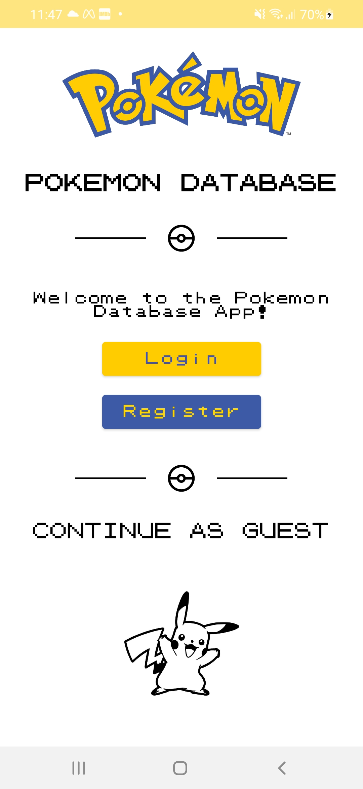
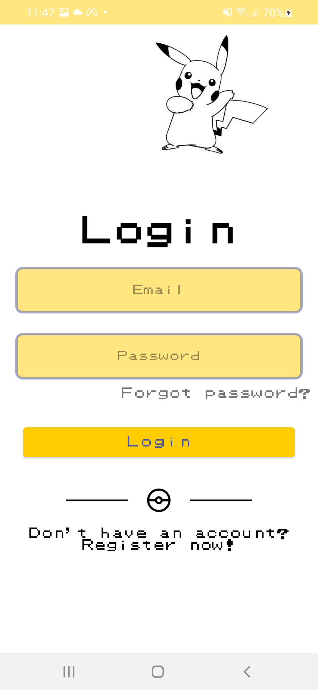
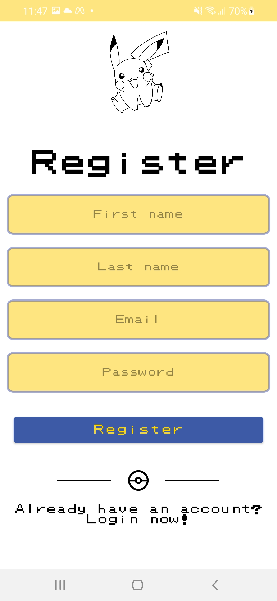
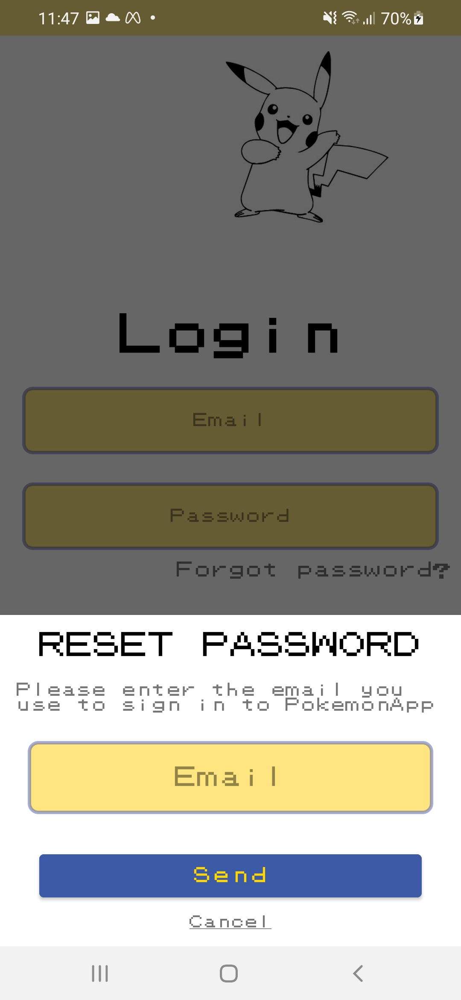

This App features:

* Kotlin
* XML
* ViewBinding
* MVVM
* Dagger Hilt
* Navigation Component
* Fragments - Activities
* Firebase Authentication
* Firebase Firestore
* Coroutines
* Flow (SharedFlow)
* Material Components (BottomSheetDialog)

Screens: Login, Register, Forgot Password

Esta app consiste en un sistema de autenticación con diseño inspirado en Pokémon. Utiliza Firebase Authentication y Firestore para la gestión de usuarios, junto con MVVM, Hilt para inyección de dependencias y Coroutines + Flow (SharedFlow) para el manejo de estado.

  
       
        
    
    

