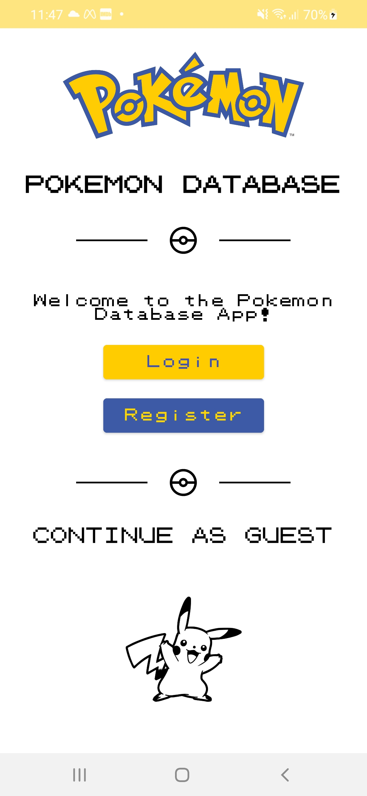

# Pokemon Database

An Android app developed with Kotlin, powered by the PokeApi REST API.

## Under Development...
Update: Login is completed!

## Some screenshots:

  
       
        
    
    

## Login features
<ul>
  <li>FirebaseAuth and Firebase Firestore</li>
  <li>MVVM</li>
  <li>Dagger-Hilt</li>
  <li>Navigation</li>
  <li>Fragments, activities, dialogs</li>
</ul>

## Coming features
Room, Retrofit, Datastore, User profile and settings, search fragment, and more!

